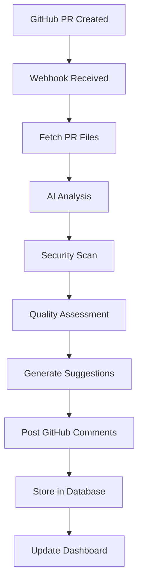

# 🤖 AI Code Review Assistant

<div align="center">


**An intelligent, automated code review system that provides AI-powered insights for any GitHub repository**

[](#features)
[](#installation)
[](#api-endpoints)
[](#dashboard)

</div>

## 🌟 Overview

AI Code Review Assistant is a sophisticated, production-ready system that automatically reviews pull requests using advanced AI analysis. It provides intelligent suggestions for code improvements, security vulnerabilities, performance optimizations, and best practices across multiple programming languages.

### 🎯 What Problem Does It Solve?

- **Automates code reviews** - No more manual review bottlenecks
- **Multi-language support** - Works with Python, JavaScript, Java, Go, and more
- **Security-first approach** - Detects vulnerabilities before they reach production
- **Quality metrics** - Tracks code quality trends across your organization
- **Real-time insights** - Immediate feedback on every pull request

## 🚀 Features

### 🤖 Intelligent Code Analysis
- **Universal Language Support** - Analyzes Python, JavaScript, TypeScript, Java, Go, Rust, and more
- **Security Vulnerability Detection** - Identifies SQL injection, XSS, hardcoded secrets, and other security issues
- **Performance Optimization** - Suggests performance improvements and anti-pattern fixes
- **Best Practices Enforcement** - Ensures code follows industry standards and conventions

### 📊 Advanced Analytics Dashboard
- **Real-time Metrics** - Live tracking of review statistics and success rates
- **Quality Scoring** - Intelligent code quality assessment with detailed breakdowns
- **Security Analysis** - Comprehensive security vulnerability reporting
- **Trend Analytics** - Historical data and improvement tracking
- **Interactive Visualizations** - Beautiful charts and graphs for data insights

### 🔧 Technical Excellence
- **FastAPI Backend** - High-performance, async-ready API server
- **GitHub Webhook Integration** - Seamless integration with GitHub ecosystem
- **SQLite Database** - Lightweight, efficient data storage
- **Modular Architecture** - Clean, maintainable codebase
- **RESTful API** - Well-documented, developer-friendly endpoints

## 🛠 Tech Stack

| Layer | Technology | Purpose |
|-------|------------|---------|
| **Backend** | FastAPI, Python 3.8+ | High-performance API server |
| **Database** | SQLite, SQLAlchemy | Data persistence and ORM |
| **Frontend** | HTML5, CSS3, JavaScript, Chart.js | Interactive dashboard |
| **AI/ML** | Custom rule-based analyzer | Intelligent code analysis |
| **Infrastructure** | GitHub Webhooks, REST API | Integration layer |
| **Deployment** | Uvicorn, Docker-ready | Production deployment |

## 📸 Screenshots

<div align="center">

### Dashboard Overview


### Code Analysis


### Review Insights


</div>

## 🚀 Quick Start

### Prerequisites
- Python 3.8 or higher
- GitHub account with repository access
- GitHub Personal Access Token

### Installation

1. **Clone the repository**
```bash
git clone https://github.com/yourusername/ai-code-review-assistant.git
cd ai-code-review-assistant
```

2. **Create virtual environment**
```bash
python -m venv venv
source venv/bin/activate  # On Windows: venv\Scripts\activate
```

3. **Install dependencies**
```bash
pip install -r requirements.txt
```

4. **Set up environment variables**
```bash
cp .env.example .env
# Edit .env with your configuration
```

5. **Configure environment variables**
```env
GITHUB_TOKEN=your_github_personal_access_token_here
GITHUB_WEBHOOK_SECRET=your_webhook_secret_here
DATABASE_URL=sqlite:///./code_reviews.db
```

### Configuration

1. **Get GitHub Personal Access Token**
   - Go to GitHub Settings → Developer settings → Personal access tokens
   - Generate new token with `repo` and `admin:repo_hook` permissions

2. **Set up GitHub Webhook**
   - Go to your repository Settings → Webhooks → Add webhook
   - Payload URL: `https://your-domain.com/api/v1/webhook/github`
   - Content type: `application/json`
   - Secret: Your `GITHUB_WEBHOOK_SECRET`
   - Events: Select "Pull requests"

3. **Initialize the database**
```bash
python -c "from server import init_db; init_db()"
```

### Running the Application

**Development mode:**
```bash
python server.py
```

**Production mode with Uvicorn:**
```bash
uvicorn server:app --host 0.0.0.0 --port 8000 --reload
```

The application will be available at:
- **API Server**: http://localhost:8000
- **Interactive Docs**: http://localhost:8000/docs
- **Dashboard**: http://localhost:8000/dashboard

## 📡 API Endpoints

### Webhooks
- `POST /api/v1/webhook/github` - GitHub webhook handler
- `POST /api/v1/webhook/test` - Test webhook endpoint

### Dashboard API
- `GET /api/v1/dashboard/stats` - Get dashboard statistics
- `GET /api/v1/dashboard/reviews` - Get all code reviews

### Health & Info
- `GET /` - API information and status
- `GET /health` - Health check endpoint
- `GET /dashboard` - Web dashboard

## 🎯 How It Works

### 1. **Webhook Integration**
- GitHub sends webhook notifications for pull request events
- System processes `pull_request.opened` and `pull_request.synchronize` events
- Automatic triggering of code review process

### 2. **Code Analysis Pipeline**


### 3. **Intelligent Analysis Layers**
- **Universal File Analysis** - Works with any file type
- **Language-Specific Rules** - Targeted analysis per language
- **Security Vulnerability Scan** - Proactive security checks
- **Code Quality Assessment** - Maintainability and best practices
- **Performance Optimization** - Efficiency improvements

## 🔍 Code Analysis Examples

### Security Vulnerabilities Detected
- ✅ SQL injection prevention
- ✅ XSS vulnerability detection
- ✅ Hardcoded secrets identification
- ✅ Insecure deserialization warnings

### Code Quality Improvements
- ✅ Code structure and organization
- ✅ Documentation completeness
- ✅ Error handling implementation
- ✅ Performance optimization suggestions

### Best Practices Enforcement
- ✅ Python PEP 8 compliance
- ✅ JavaScript ES6+ features
- ✅ Java design patterns
- ✅ Configuration management

## 📊 Dashboard Features

### Real-time Analytics
- **Review Statistics** - Total reviews, success rates, active repositories
- **Quality Metrics** - Code quality scores with trend analysis
- **Security Dashboard** - Vulnerability tracking and prioritization
- **Performance Insights** - Review duration and efficiency metrics

### Interactive Visualizations
- **Trend Charts** - Review activity over time
- **Category Analysis** - Suggestion types and frequencies
- **Quality Gauges** - Visual code quality scoring
- **Repository Overview** - Cross-repo comparison

## 🏗 Project Structure

```
ai-code-review-assistant/
├── server.py                 # Main FastAPI application
├── requirements.txt          # Python dependencies
├── .env.example             # Environment configuration template
├── code_reviews.db          # SQLite database (auto-generated)
├── templates/
│   └── dashboard.html       # Advanced analytics dashboard
├── api/
│   └── webhooks.py          # Webhook handlers
├── app/
│   ├── main.py              # Application factory
│   └── services/            # Business logic services
├── models/                  # Database models
├── utils/                   # Utility functions
└── tests/                   # Test suite
```

## 🔧 Configuration Options

### Environment Variables
| Variable | Description | Required |
|----------|-------------|----------|
| `GITHUB_TOKEN` | GitHub Personal Access Token | Yes |
| `GITHUB_WEBHOOK_SECRET` | Webhook verification secret | Yes |
| `DATABASE_URL` | Database connection string | No |
| `LOG_LEVEL` | Application log level | No |

### GitHub Webhook Events
The system automatically handles these GitHub events:
- `pull_request.opened`
- `pull_request.synchronize`
- `pull_request.reopened`

## 🚀 Deployment

### Local Development
```bash
# Run with auto-reload for development
uvicorn server:app --reload --host 0.0.0.0 --port 8000
```

### Production Deployment
```bash
# Run with production settings
uvicorn server:app --host 0.0.0.0 --port 8000 --workers 4
```

### Docker Deployment
```dockerfile
FROM python:3.9-slim

WORKDIR /app
COPY requirements.txt .
RUN pip install -r requirements.txt

COPY . .
CMD ["uvicorn", "server:app", "--host", "0.0.0.0", "--port", "8000"]
```

## 🤝 Contributing

We love contributions! Here's how you can help:

1. **Fork the repository**
2. **Create a feature branch** (`git checkout -b feature/amazing-feature`)
3. **Commit your changes** (`git commit -m 'Add amazing feature'`)
4. **Push to the branch** (`git push origin feature/amazing-feature`)
5. **Open a Pull Request**

### Development Setup
```bash
# Install development dependencies
pip install -r requirements-dev.txt

# Run tests
pytest

# Code formatting
black server.py
isort server.py
```

## 📈 Performance & Scaling

- **Async Ready** - Built with FastAPI for high concurrency
- **Efficient Database** - SQLite with connection pooling
- **Caching Layer** - Ready for Redis integration
- **Horizontal Scaling** - Stateless architecture supports multiple instances

## 🛡 Security Features

- **Webhook Signature Verification** - Ensures legitimate GitHub requests
- **Token Security** - Secure handling of GitHub tokens
- **Input Validation** - Comprehensive request validation
- **SQL Injection Protection** - Parameterized queries throughout

## 🔮 Roadmap

### Upcoming Features
- [ ] **Multi-AI Provider Support** (OpenAI, Anthropic, Local LLMs)
- [ ] **Custom Rule Engine** - Organization-specific rules
- [ ] **Team Collaboration Features** - Review assignment and tracking
- [ ] **Advanced Language Support** - More programming languages
- [ ] **CI/CD Integration** - GitHub Actions, GitLab CI, Jenkins
- [ ] **Advanced Analytics** - Machine learning insights
- [ ] **Enterprise Features** - SSO, RBAC, Audit Logs

### In Progress
- [ ] **Enhanced Security Rules** - More vulnerability patterns
- [ ] **Performance Optimization** - Faster analysis algorithms
- [ ] **Extended Test Coverage** - Comprehensive test suite

## 📄 License

This project is licensed under the MIT License - see the [LICENSE](LICENSE) file for details.

## 🙏 Acknowledgments

- **FastAPI** - For the incredible web framework
- **GitHub** - For the comprehensive API and webhook system
- **Chart.js** - For beautiful, interactive visualizations
- **SQLAlchemy** - For robust database operations

## 📞 Support

Having trouble? Here's how to get help:

1. **Check the Documentation** - This README and code comments
2. **Open an Issue** - For bugs and feature requests
3. **Discussions** - For questions and community support

## 🏆 Showcase

### Companies Using AI Code Review Assistant
*Add your company here by submitting a PR!*

### Testimonials
> "This tool has revolutionized our code review process, catching critical security issues we previously missed." - *Senior Developer, Tech Company*

> "The dashboard provides incredible visibility into our code quality trends across all repositories." - *Engineering Manager, Startup*

---

<div align="center">

**Built with ❤️ for the developer community**

[](https://star-history.com/#yourusername/ai-code-review-assistant&Date)

</div>

## 📚 Additional Resources

- [API Documentation](http://localhost:8000/docs) - Interactive API docs
- [GitHub Webhook Guide](https://docs.github.com/en/webhooks) - Webhook configuration
- [FastAPI Documentation](https://fastapi.tiangolo.com/) - Backend framework docs
- [Contributing Guidelines](CONTRIBUTING.md) - How to contribute

---

**Ready to transform your code review process? Star ⭐ this repo and start using AI Code Review Assistant today!**